# 알고리즘 스터디 2주차 문제풀이

## 문제1 : 스택수열

**아래 부분을 잘 이해를 해야한다.**

```bash
1부터 n까지의 수를 스택에 넣었다가 **뽑아 늘어놓음으로써, 하나의 수열을 만들 수 있다.** 
이때, 스택에 **push하는 순서는 반드시 오름차순을 지키도록 한다고 하자.** 
임의의 수열이 주어졌을 때 스택을 이용해 그 수열을 만들 수 있는지 없는지, 있다면 어떤 순서로 push와 pop 연산을 수행해야 하는지를 알아낼 수 있다. 
이를 계산하는 프로그램을 작성하라.

- 입력
    - 첫 줄에 n (1 <= n <= 100,000)이 주어진다. 둘째 줄부터 n개의 줄에는 수열을 이루는 1이상 n이하의 정수가 하나씩 순서대로 주어진다. **물론 같은 정수가 두 번 나오는 일은 없다.**
``` 

### 1. "뽑아 늘어놓음으로써, 하나의 수열을 만든다"
- 로직 : "스택에서 pop한 결과가 내가 입력받은 수열과 일치해야 한다."
    - **뽑아 늘어놓는다는 것은 곧 `pop` 을 의미한다**
    - 스택에서 꺼낸 숫자들을 순서대로 나열했을 때, 문제에서 입력값으로 받은 임의의 수열과 같아야 된다는 말이다
    - 그러므로 매 순간 지금 스택 위(top)에 있는 애들을 꺼내면, 내가 지금 만들어야 할 수열의 숫자와 같은가? 를 판별해야 한다

### 2. "push하는 순서는 반드시 오름차순을 지키도록 한다"
- 로직: "숫자 1부터 하나씩 스택에 넣는다"
    - 이 조건 때문에 우리는 숫자를 마음대로 스택에 넣을 수 없다
    - 예를 들어, 첫 번째 숫자가 4라고 해서 스택에 4만 쏙 넣을 수가 있는 게 아니다 
    - 그래서 아마...현재 스택 어디까지 넣었는지 count 변수 선언하고 1부터 차례로 넣어야 할듯?

### 3. 만들 수 있는지 없는지 확인
- 로직: 스택의 맨 위 숫자가 목표 숫자보다 크면 NO
    - 여기가 가장 개인적으로 까다로웠던것 같다. 
    - 아래서 직접 예를들어 설명해보겠다.

### 4. 상황 가정
- 우리가 n = 5 인 상황에서 수열 [1, 2, 5, 3, 4]를 만들어야 한다고 가정해보자.
  1. 1을 넣고(push) 바로 뺀다(pop)
  2. 2를 넣고(push) 바로 뺀다(pop)
  3. 현재 다음 넣을 번호는 3이다. 5가 나올때까지 다 넣는다.
     - 스택 상태 [3, 4, 5] (5가 맨 위)
     - 5를 뺀다(pop) -> 성공 
     - 현재 스택 상태 [3, 4] (4가 맨 위)
  4. 이제 다음으로 3을 꺼내야 한다. (수열의 네 번째 숫자가 3)
     - 근데 스택의 맨 위(top)을 보면, 4가 가로막고 있다
     - 3을 꺼내기 위해선 4를 꺼내면 수열은 [1, 2, 5, 4, ...] 가 되어버린다.
     - 우리가 원하는건 [1, 2, 5, 3, ...] 이다.

### 5. 왜 이런 일이 벌어질까?
  - 스택은 LIFO(나중에 들어온 게 먼저 나간다) 구조이기 때문이다.
  - 우리는 숫자를 오름차순 (1,2,3..)으로만 넣을 수 있다
  - 만약 내가 5를 꺼내기 위해 3,4 를 스택에 넣어두면, 나중에 이 친구들을 꺼낼 때는 무조건 역순인 4,3 순서로만 꺼낼 수 있다.
  - 즉, 스택에 들어간 순간 운명은 결정된 것이다. **"나중에 들어간 놈이 먼저 나온다" -> 스택의 본질**

### 6. 시간 복잡도 분석
  - 얼핏 보면 `for` 루프 안에 `while` 루프가 있어서 처음에 보면서 O(N^2) 이라고 생각했었다. 하지만 자세히 보면 해당 문제의 시간복잡도는 O(N) 이다.
  - 그 이유는 `current_num` 의 일생을 추적해보면 파악할 수 있다.
    1. `current_num` 변수는 **절대 뒤로 돌아가지 않는다.** 1 ~ n 까지 딱 한 번씩만 증가한다.
    2. 즉, 전체 for 루프가 돌아가는 동안 내부의 while 문이 실행되는 총 횟수는 정확히 n번이다.
    3. 스택 연산: 각 숫자는 스택에 한번 push 되고, 한번 pop된다. (2n번의 연산)
    4. 즉, O(n + n) = O(2n)이며, 빅오 표기법으로는 O(n)이 된다. n = 100,000일 때 파이썬에서도 0.1초 내외로 넉넉하게 통과할 수 있다.

### 7. 문제 자체에서 제목부터 '스택 수열' 이라고 했는데 진짜 스택외 더 효율적인 방법은 없을까?
  - 흠...아무리 생각해봐도 "스택"외에 좋은 방법이 생각이 안난다.
  - 이유는 아래와 같다.
    1. **문제의 제약 조건 (LIFO)**
       - 문제에서 1부터 n까지 오름차순으로 넣었다가 뽑아 늘어놓는다고 명시했다. 이건 전형적인 LIFO(Last In First Out)의 상황이다.
       - 만약에 자료구조 큐(Queue)를 이용해서 풀려고 생각해봤다. 근데 문제 조건상 먼저 들어간 1이 나와야 하므로 [4, 3, 2, 1] 같은 역순 수열을 절대 만들 수 없다
       - 리스트 인덱싱? 중간에 있는 숫자를 마음대로 꺼내는 꼴이 되고 "뽑아 늘어놓는다" 는 제약 조건을 어긴다.

    2. **스택 정렬 가능성(Stack-sortability)**
       - 컴퓨터 과학에서는 스택 정렬 가능성 이라는 개념이 있다. 특정 수열이 스택을 통해 정렬 될 수 있는지 판단하는 것이다.
       - 예시 [4, 1, 2] 순서로 꺼내야 한다고 치자
       - 4를 꺼내려면 이미 1,2,3 스택에 들어가 있어야 한다. (스택 : [1, 2, 3, 4])
       - 4를 pop 한 뒤, 그 다음으로 1을 꺼내야 하는데...맨 위는 3이 가로막고 있다.
       - 이런 구조적 한계 때문에 스택이 정답이고..어 그 외에는 잘 안떠오른다.
 
### 8. 위의 예시 시각화
1. 


2. 


3. 


4.


---

## 문제2 : 주식가격

### 1. **문제이해** : 가격이 떨어진다의 정확한 의미
- 유지 : (현재 가격 <= 다음 가격) -> 가격이 떨어지지 않음
- 하락 : (현재 가격 => 다음 가격) -> 가격이 떨어짐

### 2. 입출력에서의 [1, 2, 3, 2, 3] 상세 분석
입출력 예시를 한번 보자.

| 시점 (초) | 가격 | 분석                                                           | 유지 기간 |
|----------|------|--------------------------------------------------------------|----------|
| 1초 | 1원 | 뒤에 1보다 작은 값이 없으므로 끝까지(5초까지) 유지                               | 4초 (5 - 1) |
| 2초 | 2원 | 뒤에 2보다 작은 값이 없으므로 끝까지 유지                                     | 3초 (5 - 2) |
| 3초 | 3원 | 4초 시점에 2원이 되면서 가격이 떨어진다. 하지만 3초에서 4초가 되는 그 1초 동안은 가격이 유지된 것으로 본다 | 1초 |
| 4초 | 2원 | 뒤에 2보다 작은 값이 없으므로 끝까지 유지                                     | 1초 (5 - 4) |
| 5초 | 3원 | 마지막 시점이라 더 이상 비교할 대상이 없다                                     | 0초 |

### 3. 문제 요약
해당 문제는 각 주식 가격에 대해 다음 두 가지 중 하나를 구하는 것이다
1. 가격이 떨어지는 경우 : 떨어지는 순간까지 걸린 시간 (예 : 3초 -> 4초 하락 시 4 - 3 = 1)
2. 가격이 끝까지 안 떨어지는 경우 : 전체 길이에서 현재 시점을 뺀 남은 시간

### 문제풀이에 대한 방법들 (2가지로 풀어봤슴다)

### 4. 첫 번째 방법(Brute Force)
가장 먼저 직관적으로 떠올린 방법이다. 가볍고 간단하게 직관적으로 먼저 떠오른 이중 반복문을 사용하여 해당 문제를
이해하고 해결하는 확실한 방법을 먼저 떠올렸다.

- 각 시점의 가격을 하나씩 잡고(i), 그 뒤의 가격들(j)과 하나하나 비교하며 시간을 카운트하는 방식이다.
  - 바깥쪽 루프(i) : 주식 가격을 하나씩 선택한다(기준점)
  - 안쪽 루프(j) : 기준점(i) 이후의 가격들을 확인한다
  - 시간 계산 : 안쪽 루프가 한 번 돌 때마다 시간을 1초씩 더한다
  - 중단 조건 : 만약 기준점보다 작은 가격이 나타나면? 시간을 더하고 바로 break 해서 나온다.

해당 방식에서의 코멘트 : 이 방식은 아주 직관적이지만, 주식 가격의 개수가 n개일 때, 약 n^2번의 연산이 필요하다 O(n^2) 복잡도

### 5. 두 번째 방법(Stack) 활용
해당 방식에서의 스택을 활용한 방법도 있다. 
가격이 떨어질 때까지 인덱스를 스택에 보관한다는 점이다. 떨어지지 않은 애들을 잠시 스택에 넣었다가, 가격이 떨어지는 순간 스택에서 다시 꺼내어
기간을 계산하는 방식이 있다.

**(Sudo code)**
1. 결과를 저장할 리스트(answer)를 주식 가격 개수만큼 0으로 초기화 한다.
2. 인덱스를 담을 빈 스택을 만든다.
3. 주식 가격 리스트를 처음(i = 0) 부터 끝까지 하나씩 확인한다.
   - **핵심 반복문** : 만약 스택이 비어있지 않고, 현재 가격 <= 스택 맨 위(top) 인덱스의 가격이라면?
     - 가격이 떨어진 것이므로, 스택에서 인덱스를 꺼낸다 (pop)
     - 이 주식의 유지 기간은 `현재시점(i) - 꺼낸 인덱스` 가 된다.
   - 현재 인덱스(i)를 스택에 넣는다 (push)
4. 전체 순환이 끝난 후에도 스택에 남아있는 인덱스들은? 
    - 이들은 끝까지 가격이 떨어지지 않은 주식들이다.
    - `전체 시간(마지막 인덱스) - 남은 인덱스` 로 유지 기간을 계산해 채워준다.
5. 예시로 보는 시뮬레이션 ([1, 2, 3, 2, 3])
    - 1초(1원) : 스택에 [0] 추가
    - 2초(2원) : 1원보다 크니까 스택에 [0, 1] 추가
    - 3초(3원) : 2원보다 크니까 스택에 [0, 1, 2] 추가
    - 4초(2원) : 하락 발생! 스택 TOP인 2번 인덱스(3원)보다 현재(2원)이 더 작다(하락 발생)
      - 2번 인덱스 `pop` -> 기간은 4초 - 2번(3초) = 1초
      - 그 다음 스택 TOP인 1번 인덱스 (2원)은 현재와 같으므로 그대로 둔다
      - 현재 인덱스 추가 -> 스택 : [0, 1, 3]
    - 5초(3원) : 스택 TOP인 3번(2원)보다 크니까 스택에 [0, 1, 3, 4] 추가
    루프 종료 후 스택에 남은 [0, 1, 3, 4] 처리
    - 전체 길이(5)를 기준으로 각각의 유지 기간을 계산하여 정답 완성

### 6. 시각화

1. 
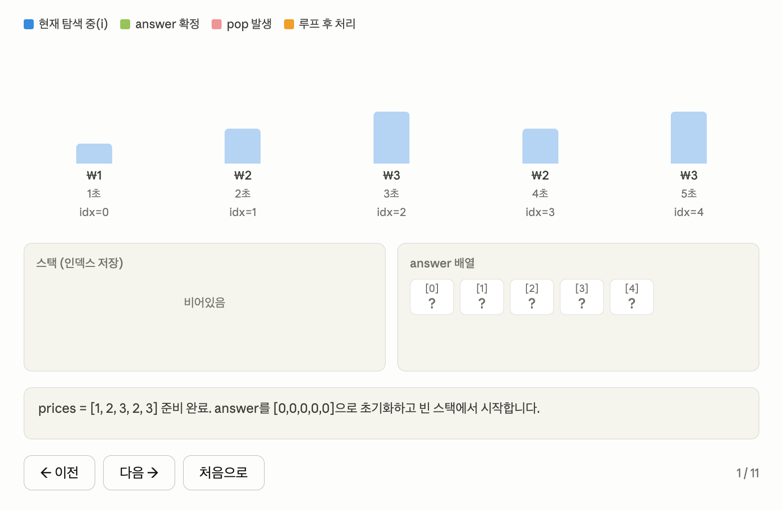

2. 
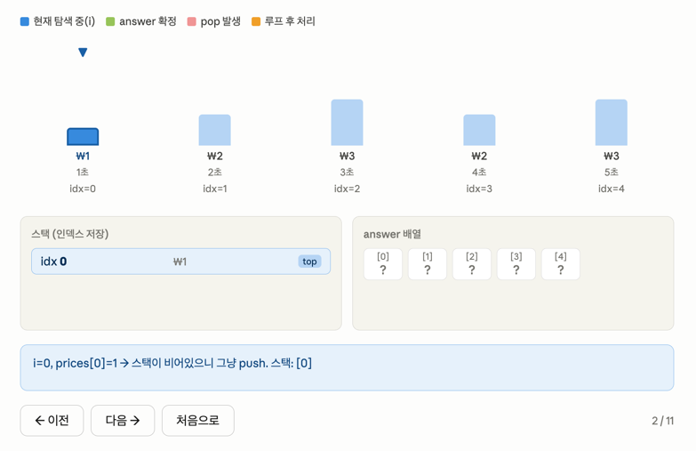

3.
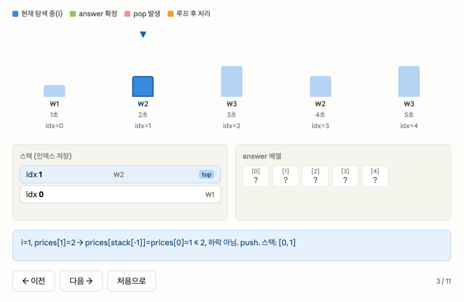

4.
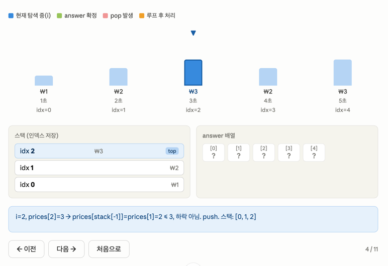

5.
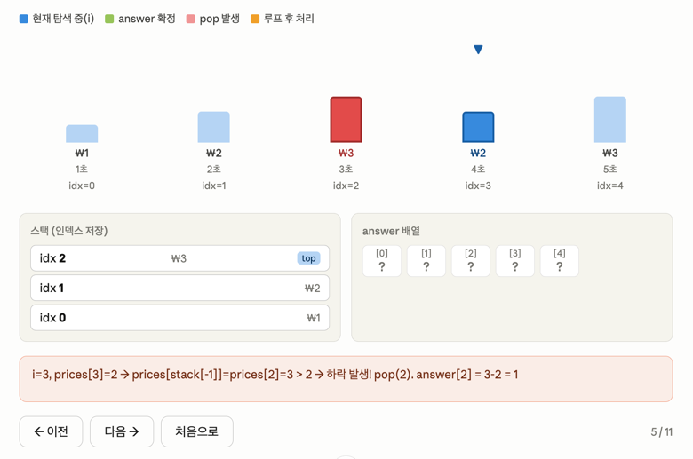

6.
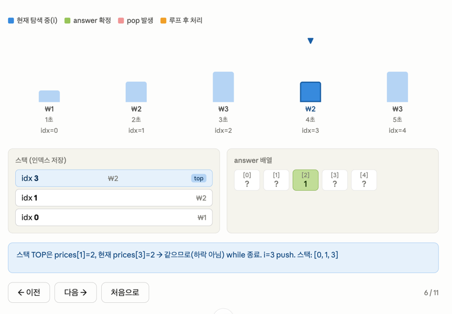

7.
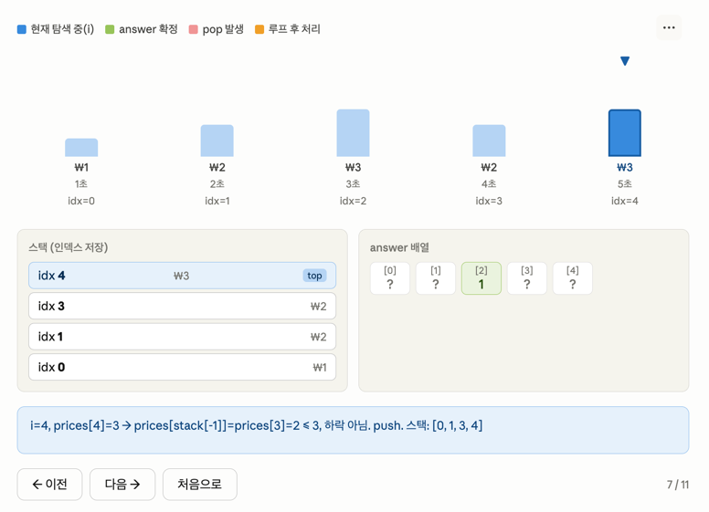

8.
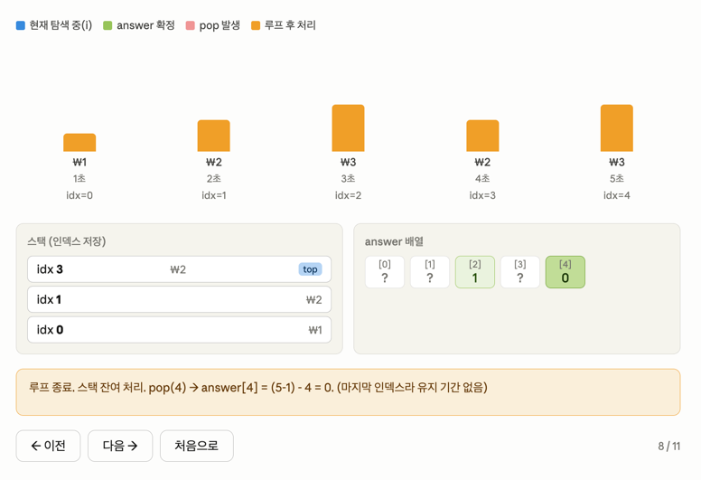

9.
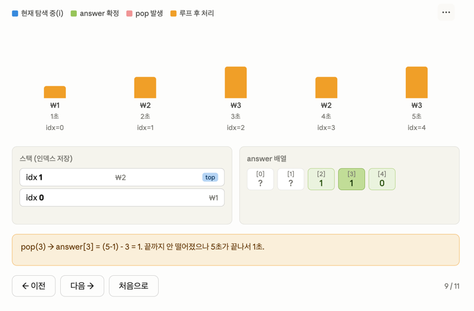

10.
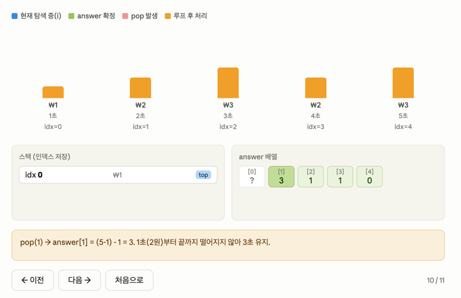

11.
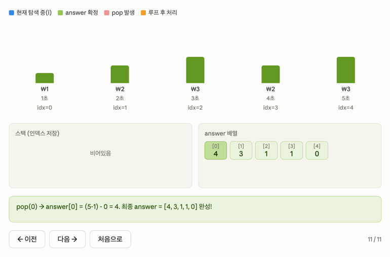