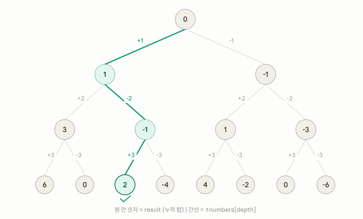

# 알고리즘 스터디 3주차 문제풀이

## 문제1 : 타겟 넘버

**문제 자체 로직은 간단했다.**

배열의 값들이 주어졌을때 어떤 플러스, 마이너스 조합을 통해서 타겟 값을 만들 수 있는지 
즉, 몇가지 경우의 수가 있는지를 구하는 문제였다.

### 1. 첫 풀이로 브루트 포스 방법으로 해결한 이유
- 로직 : 우선은 가볍게 브루트 포스 방법을통해 일일이 노가다를 계산해보는 방법이다.
    - 해당 브루트 포스 방법을 사용한 이유는 다음과 같다. 조합 경우의 수는 각 인덱스의 +- 경우의 수 이므로 2^length(배열) 이었다.
    - 배열의 길이는 최대 20이므로 최악의 경우 O(2^20) 이 나올 수 있는 숫자였다.
    - 근데 위의 경우는 파이썬의 연산 처리량인 초당 1억개의 연산 처리가 가능하므로, 2²⁰ = 1,048,576 ≈ 100만, 100만 / 1억 = 0.01초 이므로 충분히 가능할것이라 생각했다.
    - 그래서 해당 문제는 완전 탐색이 가능한 풀이라 판단하고 브루트 포스 방법으로 우선 시도했다. 

### 2.  브루트 포스 방법으로 그러면 어떻게 해결할까?
- 로직 : 
  1. 각 숫자마다 (+x, -x) 선택지를 튜플로 만든다 -> options
  2. itertools.product 로 모든 조합을 생성한다 (2^n 가지)
  3. 각 조합의 합계를 계산한다
  4. target과 일치하는 경우의 수를 센다
  5. 시간복잡도 : O(2^n) - n 최대 20이므로 약 100만, 시간 초과 X

### 3. 브루트포스(노가다) 방법이라해도 조금 현명하게 쓰자
1. **리스트 컴프리헨션**
   - 파이썬에는 리스트 컴프리헨션이란 방법이 있다. 대충 아래와 같은 방법으로 쓴다
   ```python
    options = [(x, -x) for x in numbers]
    case_sums = [sum(case) for case in product(*options)]
    
    # 대충 [(형식) for 반복문 변수 in 어디를 순회할지?] 이런형식으로 된 것이다.
    ``` 
    - 해당 의미는 numbers 의 배열을 돌며 이를 튜플 형태로 쌍으로 저장을 한다는 것이다. (형식의 경우는 자유이다)
    - 이 리스트 **컴프리헨션(List comprehension)** 이라는 방식을 사용한 이유는 CPython 이기 때문이다.
    - 이게 무슨 말이냐면 해당 리스트 컴프리헨션 구현이 백그라운드가 C로 되어 있어서 일반 for문보다 속도가 빠르다.
    - 단순 반복은 리스트 컴프리헨션으로 대체를 하는것이 좋다

2. **itertools.product**
    - n개의 선택지가 있을 때 n겹 중첩 for 문을 자동으로 대신해준다
    - 내부 백그라운드도 C 구혀이라 직접 중첩 for 문 작성보다 빠르다.
    - `*options` 로 *언패킹해서 넘기면 리스트 길이에 상관없이 동작
    - (참고! 언패킹이란? -> 말 그대로 튜플이나 리스트를 풀어서 개별 인자만 넘기는 것이다)

3. **꼼수도 알아야 쓴다**
    - 리스트 컴프리헨션, itertools.product, 언패킹,...이런 도구들을 알고 있어야 떠올릴 수 있다.
    - 브루트포스라도 어떤 도구를 쓰느냐에 따라 가독성과 성능이 달라진다.
    - 파이썬 내장 라이브러리 꾸준히 익힐것

4. 속도차이

```bash
 gimgawon 🚀 > week3 > feat/gawon > python3 43165_타겟넘버.py
product + list comprehension 결과: 5
일반 for 브루트포스 결과: 5
DFS 결과: 5

반복 횟수: 10000
product + list comprehension 실행 시간: 0.018514초
product + list comprehension 1회 평균 시간: 0.0000018514초
일반 for 브루트포스 실행 시간: 0.054847초
일반 for 브루트포스 1회 평균 시간: 0.0000054847초
DFS 실행 시간: 0.023190초
DFS 1회 평균 시간: 0.0000023190초

가장 빠른 방식: product + list comprehension
가장 느린 방식: 일반 for 브루트포스
가장 빠른 방식과 가장 느린 방식의 총 실행 시간 차이: 0.036332초
product + list comprehension 방식이 일반 for 브루트포스 방식보다 약 2.96배 빠릅니다.
```

### 4. 두 번째 풀이 방법 (DFS)
- 로직: 본 문제는 각 숫자마다 두 가지 선택지(+, -)가 존재하므로, 전체 경우의 수는 2^n 개이다. 이를 이진 결정 트리(Binary Decision Tree) 구조로 파악하여 모든 경로를 탐색한다.

사고 흐름
1. 완전 탐색 : 숫자의 개수가 최대 20개이므로 2^20 = 10^6 정도이다. 1초 내에 충분히 연산 가능하므로 브루트포스(DFS)를 선택했다.
2. 재귀 구조 : 각 노드에서 다음 노드로 넘어갈 때 현재까지의 합계를 인자로 전달하여 끝(Leaf Node)까지 파고든다
3. 상향식 합산 : 리프 노드에서 `target` 과 일치하면 1을, 아니면 0을 반환하여 위로 올라오면서 그 값을 모두 합산한다.

### 5. 예시를 통한 흐름 파악
**예시로 `numbers = [1, 2, 3]`, `target = 2` 를 한번 보자**
이것을 전체 DFS 흐름 과정이 어떻게 이어지나 한번 확인해보자

1. 시작 (depth = 0) : `result = 0` 에서 출발하고, `numbers[0] = 1` 이므로 두 갈래 -> +1로 가면 `result = 1`, -1로 가면 `result = -1`
2. depth = 1 : numbers[1] = 2 를 처리, `result = 1` 노드에서 또 두 갈래 -> +2 면 3, -2면 -1... `result = 1` 노드에서도 마찬가지
3. depth = 2 (리프) : `nubers[2] = 3` 을 처리. 이게 마지막 숫자 (`depth == len(numbers)`) 이므로 재귀가 여기서 멈추고 `result = target(2)` 인지 체크
4. 정답 경로 : 0 -> 1 -> 2-> +3 -> `result = 2` target = 2랑 같으니까 += 1

이렇듯이 DFS는 가능한 모든 경로를 끝까지 파고든 다듬 되돌아오면서(백트래킹) 다음 경로를 탐색하는 구조이다.
총 경로 수는 항상 2^n (여기서는 2^3 = 8)

(아래는 위의 설명에 대한 시각화) 



### 6. 세 가지 풀이 방식 성능 비교 정리
이번에 비교한 방식은 아래 3가지이다.

1. `product + list comprehension` 방식
2. 일반 `for` 문 브루트포스 방식
3. DFS 재귀 방식

세 방식 모두 결국 가능한 부호 조합을 전부 탐색하므로 시간복잡도 자체는 `O(2^n)` 으로 동일하다.
다만 실제 실행 시간은 파이썬에서 어떤 방식으로 반복을 처리하느냐에 따라 차이가 생겼다.

- `product + list comprehension` 방식은 `itertools.product` 와 리스트 컴프리헨션이 내부적으로 최적화되어 있어 가장 빠르게 나왔다.
- DFS 방식은 재귀 호출 비용이 있지만, 일반 `for` 브루트포스보다 코드 흐름이 문제 구조와 잘 맞고 실행 시간도 준수했다.
- 일반 `for` 브루트포스 방식은 비트마스크를 직접 순회하므로 원리는 명확하지만, 파이썬 레벨의 반복문과 조건문이 많아서 가장 느리게 나왔다.

정리하면, 이 문제는 세 방식 모두 통과 가능한 풀이지만 다음과 같이 구분할 수 있다.

- 성능을 우선하면 `product + list comprehension`
- 문제 구조를 가장 직관적으로 표현하면 DFS
- 완전 탐색 원리를 가장 직접적으로 보여주면 일반 브루트포스

실행결과
```bash
product + list comprehension 결과: 5
일반 for 브루트포스 결과: 5
DFS 결과: 5

반복 횟수: 10000
product + list comprehension 실행 시간: 0.023059초
product + list comprehension 1회 평균 시간: 0.0000023059초
일반 for 브루트포스 실행 시간: 0.056452초
일반 for 브루트포스 1회 평균 시간: 0.0000056452초
DFS 실행 시간: 0.023211초
DFS 1회 평균 시간: 0.0000023211초

가장 빠른 방식: product + list comprehension
가장 느린 방식: 일반 for 브루트포스
가장 빠른 방식과 가장 느린 방식의 총 실행 시간 차이: 0.033394초
product + list comprehension 방식이 일반 for 브루트포스 방식보다 약 2.45배 빠릅니다.
```

---

## 문제2 : 무인도여행

흠...직감적으로 해당 문제를 보자마자 `스택` 을 가장 먼저 떠올리게 되었다.
이를 해결하기 위한 한 줄 요약을 해보자면

> 아직 안 밟은 땅을 발견하면, 거기서부터 스택으로 연결된 땅을 전부 탐색해서 합산한다.

단계별로 생각해보자.

### 1. DFS 방법
1단계
- 시작점 찾기 : 격자를 위 -> 아래, 왼 -> 오른쪽으로 쭉 훓는다. 칸이 X면 스킵, 숫자면서 아직 방문 안했으면, 여기서 새 섬 탐색 시작

2단계
- 스택에 시작점 넣기 : 발견한 좌표를 스택에 push하고, visited 표시

3단계 (여기가 핵심이다)
- 스택이 빌 때까지 반복
  - 스택에서 좌표 하나 pop
  - 그 칸의 숫자를 total에 더함
  - 상하좌우 4방향을 확인 -> 범위 내 + 숫자 + 미방문이면 스택에 push + visited 표시

4단계
- 스택이 비면 섬 하나 완성 : total을 결과 배열에 저장하고, 1단계로 돌아가서 다음 시작점 탐색 계속

5단계
- 전부 순회 완료 : 결과 배열을 오름차순 정렬해서 반환, 비어있으면 -1

### 2. 왜 DFS로 접근했나?
이 문제는 단순히 한 칸씩 값을 계산하는 문제가 아니라, 서로 연결된 숫자 칸들을 하나의 묶음으로 봐야 하는 문제이다.
즉, 격자 안에서 `X` 가 아닌 칸들이 상하좌우로 연결되어 있으면 하나의 무인도이고, 그 무인도 안의 숫자를 모두 더해야 한다.

이런 유형은 보통 `연결 컴포넌트` 탐색 문제로 볼 수 있다.
그래서 특정 땅을 하나 발견했을 때, 그 땅과 연결된 모든 땅을 끝까지 탐색해야 한다.
이때 사용할 수 있는 대표적인 방법이 DFS 또는 BFS이다.

나는 여기서 DFS를 선택했다.
이유는 다음과 같다.

1. 시작점 하나를 잡고, 연결된 땅을 끝까지 파고드는 방식이 문제 설명과 잘 맞았다.
2. 재귀 DFS로 풀 수도 있지만, 격자의 크기가 커지면 재귀 깊이 문제가 생길 수 있어서 스택을 이용한 반복문 DFS가 더 안전하다고 판단했다.
3. 방문 체크만 제대로 하면 각 칸은 딱 한 번만 탐색되므로 효율적이다.

### 3. 방문 체크가 중요한 이유
이 문제에서 `visited` 배열은 필수이다.
방문 체크를 하지 않으면 같은 땅을 여러 번 다시 방문할 수 있다.

예를 들어 어떤 숫자 칸에서 오른쪽 칸으로 이동하고, 다시 그 오른쪽 칸에서 왼쪽으로 이동하면 원래 칸으로 돌아올 수 있다.
이 과정이 반복되면 중복 계산이 발생하거나, 심하면 무한 반복에 빠질 수 있다.

그래서 숫자 칸을 스택에 넣는 순간 바로 `visited = True` 로 바꿔준다.
이렇게 하면 같은 칸이 스택에 여러 번 들어가는 것을 막을 수 있다.

### 4. 시간복잡도
격자의 세로 길이를 `R`, 가로 길이를 `C` 라고 하면 전체 칸의 개수는 `R * C` 이다.

전체 격자를 한 번 순회하면서 시작점을 찾고, DFS 과정에서도 각 칸은 최대 한 번만 방문한다.
따라서 시간복잡도는 `O(R * C)` 이다.

공간복잡도도 `visited` 배열이 필요하고, DFS 스택에 최악의 경우 모든 칸이 들어갈 수 있으므로 `O(R * C)` 이다.

### 5. 주의할 점
1. `X` 는 바다이므로 탐색 대상에서 제외해야 한다.
2. 숫자 칸이라도 이미 방문했다면 다시 탐색하면 안 된다.
3. 섬이 여러 개일 수 있으므로, DFS가 한 번 끝났다고 전체 탐색을 종료하면 안 된다.
4. 모든 섬의 식량 합계를 구한 뒤 오름차순으로 정렬해야 한다.
5. 숫자 칸이 하나도 없다면 문제 조건에 맞게 `[-1]` 을 반환해야 한다.

### 6. 예시 흐름
예를 들어 아래와 같은 입력이 있다고 해보자.

```python
maps = ["X591X", "X1X5X", "X231X", "1XXX1"]
```

격자를 위에서 아래, 왼쪽에서 오른쪽으로 훑다가 처음 만나는 숫자 칸에서 DFS를 시작한다.
그 위치와 상하좌우로 연결된 숫자 칸을 전부 탐색하면서 값을 더한다.
DFS가 끝나면 섬 하나의 총 식량 수가 완성된다.

이 과정을 모든 칸에 대해 반복하면 각각의 무인도 식량 합계를 구할 수 있다.
위 예시에서는 결과가 아래처럼 나온다.

```python
[1, 1, 27]
```

즉, 식량 합이 `1` 인 섬 2개와 식량 합이 `27` 인 섬 1개가 존재한다는 의미이다.

---

## 문제 3. 게임 맵 최단거리

문제를 이해하는것은 쉬웠다. 목표 지점까지 얼마나 빠르게 **최단경로를** 구하는 문제였다.

내가 떠올린 직관은 다음과 같다.

### 문제 해결을 위한 나의 직관들
- 처음 떠올린 방법들
  - 스택 기반 DFS (학부생때 자료구조 수업때 스택으로 풀었던 미로찾기)
  - 다익스트라 (최단경로 하면 바로 떠오름)
  - RC카
    - 갑자기 뜬금없이 왠 RC카? 일수도 있다. 예전에 이건 유튜브 영상에서 봤는데 RC카 미로찾기 대회에서 1등한 팀이 특별한 알고리즘을 사용한게 아니라, 그냥 RC카 속도를 무지성으로 빠르게 올리고 모든 미로를 다 탐색하면서 1등한 영상을 봐서 여기서 아이디어가 나오지 않을까 생각해봤다.
  - 세번째 아이디어인 RC카와 관련된 얘기를 클로드에게 한번 해봤다. 클로드는 이 아이디어를 듣고 BFS 방법을 추천해줬다. (이유는 아래와 같다)
    - BFS가 최적인 이유?
    - 1. 가중치가 균일(모두1) 할때 BFS = 최단거리 자동 보장
    - 2. DFS는 모든 경로 탐색해야 되서 느림

### 전체 흐름과 슈도코드

BFS는 "가까운 곳부터 퍼져나가는" 탐색이다.
거리 1인 칸 전부 → 거리 2인 칸 전부 → ... 순서로 탐색하기 때문에
목적지에 처음 닿는 순간이 곧 최단거리가 된다.

1. 초기화
   - 시작점 (0, 0)을 큐에 넣는다 → (r, c, dist) 튜플로
   - dist를 1로 시작하는 이유: 시작 칸 자체도 "지나간 칸"이므로
   - visited[0][0] = True → 시작점도 방문 처리

2. while queue (큐가 빌 때까지 반복)
   - 큐에서 (r, c, dist) 꺼냄
   - 목적지 체크: r == rows-1 and c == cols-1 이면 dist 리턴
     → 꺼낸 직후 체크하는 이유: BFS 특성상 처음 꺼낼 때 = 최단거리 확정
   - 4방향 탐색 (상하좌우)
     → 범위 체크: 맵 밖으로 나가면 Python 음수 인덱스로 조용히 오동작함
     → 벽 체크: maps[nr][nc] == 1
     → 방문 체크: visited[nr][nc] == False
     → 3가지 통과하면: visited = True 먼저, 그다음 큐에 (nr, nc, dist+1) 추가
       (순서 중요: 큐에 먼저 넣으면 같은 칸이 중복으로 들어갈 수 있음)

3. while이 끝났는데 리턴 못 했다면
   - 큐가 텅 빌 때까지 목적지에 못 닿은 것 = 벽에 가로막힌 경우
   - return -1

### 시간복잡도
- 시간: O(n * m)
  - 이유: visited 체크 덕분에 모든 칸을 최대 한 번만 방문한다
  - 각 칸에서 하는 일: 4방향 탐색 (상수 시간, O(4) = O(1))
  - 따라서 전체 = (칸의 수) * (칸당 작업) = n*m * 1 = O(n*m)
  - 이 문제에서 n, m 최대 100 → 최대 10,000번 연산 (매우 빠름)
